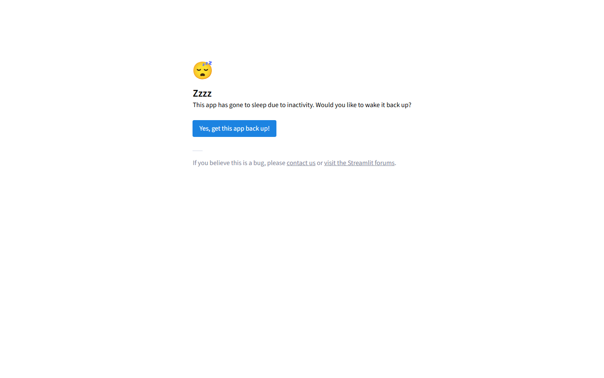

# 🌱 ZEB-ROI · 그린리모델링 의사결정 플랫폼

**BIM 한 번으로 공공건축물 그린리모델링 전 과정을 자동 분석하는 챗봇**

### ▶︎ **[라이브 데모 — zeb-bim-tool.streamlit.app](https://zeb-bim-tool.streamlit.app)**

[](https://www.python.org/)
[](https://streamlit.io/)
[](https://www.anthropic.com/)
[](#-테스트)

> ⏰ 무료 티어라 접속이 없으면 잠듭니다. 첫 로딩이 느리면 깨어나는 중입니다 (~30초).



> 2026년 졸업설계 작품 (성균관대 · 삼성E&A 환경에너지탐구대회). 케이스: KEPCO 김천 도담어린이집 (연면적 1,251㎡).
> **검증 결과 (외피 보강)**: NPV **+1.08억** · IRR **14.7%** · B-C **2.19** · 할인회수 **8.2년**
> (자부담 기준, 20년·할인율 4.5%) · 수익환원 자산가치 **2.48억** (환원율 5%, NPV와 별도)

> ⚠️ **위 수치는 가정치를 포함합니다 — 그대로 인용하지 마세요.**
> 연간 에너지 절감액은 아직 `연면적 × 9,900원/㎡`라는 **근거 없는 단일 계수**이며 kWh 절감량과 연결돼 있지 않습니다.
> 요소별 절감률(외벽단열 15% 등)과 base 200 kWh/㎡·년의 **출처를 아직 찾지 못했습니다.**
> 무엇이 확인됐고 무엇이 가정인지는 앱의 **[📐 근거·출처]** 모드에서 전부 공개합니다.

> 🔧 **2026-07: 우리 헤드라인을 우리가 낮췄습니다 — 4등급 → 5등급.**
> 엔진이 11개 요소의 절감률을 **단순 덧셈**해 67%를 얻고 있었습니다. 단순합산은 물리적으로 성립하지
> 않습니다 — 10% 절감 요소가 11개면 110%가 되어 **에너지가 음수**가 됩니다.
> 각 요소가 *남은* 에너지를 줄이는 **1 − Π(1−rᵢ)** 로 바로잡으니 절감률 **50.5%**,
> 1차E 소요량 **99.1** → **ZEB 5등급**(4등급 임계 90 미달)이 됐습니다.
> 즉 기존 4등급은 건물 성능이 아니라 **산정 방식의 산물**이었습니다.
> 실측 뒷받침 — 에너지경제연구원 기본연구보고서 2025-14(2026-06): GR 공공건축물 **522동(어린이집 358동)**
> 실측 연간 **20.4 kWh/㎡** 절감으로 엔지니어링 예측 **33 kWh/㎡의 약 60% 수준**.

---

## 📌 한 줄 요약

Revit BIM 모델을 업로드하면 11개 GR 기술요소 자동 평가 → 보강 우선순위 + Max Cost + 보조금 + 회수기간을 통합 산출하는 **6-모드 플랫폼**.

## 🧭 방향성 (확정)

> **AI Agent 기반 ZEB / 그린리모델링 평가 및 ROI 산정**

| 원칙 | 내용 |
|---|---|
| **Agent + RAG > 파인튜닝** | 단가·법령·보조율이 수시로 바뀌어 파인튜닝은 stale해진다 |
| **계산은 엔진이, 언어만 LLM이** | 숫자는 결정론적으로 산출 — LLM은 조건 추출·설명·오케스트레이션만 |
| **법령은 RAG로 원문 인용** | 없으면 없다고 답해 환각 차단 (실무 담당자 피드백 검증) |
| **ZEB ≠ 그린리모델링** | 근거 법령·판정이 다른 별개 제도 → 판정은 분리, 데이터·해석 기반은 공유 |

**두 트랙**

| | Track A · ZEB 인증 | Track B · 그린리모델링 사업 |
|---|---|---|
| 근거 | ZEB 인증기준 고시 (제1·2·3호) | GR 가이드라인 정량평가표 |
| 판정 | 자립률/1차에너지 + BEMS → +등급~5등급 | 100점 → A+~D |
| 공유 | **BIM 파싱 · 에너지 해석 · 단가DB · 법령 RAG** | |

📄 **상세 아키텍처·로드맵 → [`docs/ARCHITECTURE.md`](docs/ARCHITECTURE.md)**
(에너지 해석 물리화(eppy/EnergyPlus), BIM 입력 경로(gbXML/IFC/APS) 결론 포함)

## 🎯 무엇을 자동화하는가

기존엔 건축사·설비기사·세무사·시공사가 **각자 따로** 계산하던 항목들을 **하나의 BIM 입력**으로 통합:

| 분야 | 기존 작업 | 자동화 결과 |
|---|---|---|
| **건축** | 11개 기술요소 진단표 수기 작성 | BIM JSON → 자동 매핑 (Mode 3) |
| **시공** | 견적사 수기 견적 (수일~수주 소요) | 07/08 단가DB로 즉시 산출 (Mode 3) |
| **법무** | 04 녹색건축법 §15, 05 §47의2 일일이 확인 | 보조금·용적률·취득세 한 번에 (Mode 2) |
| **행정** | 사업 신청서 빈칸 채우기 | 챗봇과 대화로 자동 생성 (Mode 4) |
| **컨설팅** | 정책 조항 검색 | RAG 기반 출처 인용 답변 (Mode 1) |

## ✨ 6가지 모드

| 모드 | 입력 | 출력 | API 키 |
|---|---|---|---|
| 🏠 **홈** | — | 검증 결과 요약 · 두 트랙 구조 | 불필요 |
| 🏢 **BIM 진단 + ROI** | Revit BIM JSON | 11개 매핑 + 등급 + 보강 우선순위 | 불필요 |
| 💬 **정책 Q&A (RAG)** | 자연어 질문 | 근거 조항 인용 답변 | 필요 |
| 💰 **ROI 시뮬레이션** | 자연어 ("연면적 1,200㎡, ZEB 5등급") | Max Cost / 보조금 / 회수기간 | 필요 |
| 📋 **사업 신청 인테이크** | 챗봇 대화 | 신청서 마크다운 초안 | 필요 |
| 📐 **근거·출처** | — | 파라미터 출처 · 확인필요 목록 · 등급 민감도 | 불필요 |

### 📐 근거·출처 — 이 프로젝트의 차별점

산출된 숫자가 **어느 조항의, 언제 시행된 값**인지를 `data/params/*.yaml`에서 **실시간으로 읽어** 보여주고,
**아직 확인 못 한 값**(전기요금 단가 등)을 숨기지 않고 `확인 필요`로 공개합니다.
등급이 뒤집히는 **임계 절감률**은 손으로 적은 값이 아니라 **엔진을 호출해 이분탐색으로 재현**하며,
`scripts/test_evidence.py`가 그 재현을 테스트로 고정합니다 — 기준표가 바뀌면 테스트가 깨집니다.

**이 모드가 우리 헤드라인을 스스로 무너뜨렸습니다.** 절감률 결합 방식을 4가지로 나란히 계산해 보니
기존 4등급이 단순합산에서만 성립한다는 게 드러났고, 그래서 엔진을 고쳐 5등급으로 낮췄습니다.
불리한 결과를 감추지 않는 것이 이 모드의 목적입니다.

> 설계 철학: *숫자는 결정론적 테이블에서 조회하고, RAG는 "그 근거가 뭐냐"에 답하는 데만 쓴다.*
> 전기요금표처럼 매트릭스에서 셀을 고르는 일을 LLM에 시키면 **틀려도 그럴싸해서 조용히 틀린다(silent error).**

## 🗂 데이터 출처

**RAG 색인 = 12개 법령·고시·공고 원문 (974청크)**

| # | 문서 | 시행 |
|---|---|---|
| 04 | 녹색건축물 조성 지원법 (제20727호) | 2026-02-01 |
| 10 | 같은 법 **시행령** (제36231호) | 2026-03-31 |
| 11 | GR 지원사업 운영 고시 (국토부 제2023-385호) | 2023-07-01 |
| 12 | ZEB 인증에 관한 규칙 (**기후에너지환경부령 제1호**) | 2025-10-01 |
| 06 | 에너지절약설계기준 (제2025-738호) | 2025-12-31 |
| 05 | 지방세특례제한법 | — |
| 13 | 건축법 시행령 (제35717호) | — |
| 14 | 공공기관의 운영에 관한 법률 | — |
| 15 | 탄소중립기본법 시행령 (제36303호) | — |
| 16·17 | 2026년 GR 공고 (민간 이자지원 / 공공 2.0) | 2026 |
| 18 | **2026 공공 GR 2.0 가이드라인** (정량평가 배점표 원문) | 2026-04 |

**산정 데이터 (RAG 아님 — 결정론적 조회)**
- **07_조달청_단가DB** — 자재별 단가 + 시공계수 (442자재)
- **08_조달청_간접공사비** — 공사기간별 간접비율
- **`data/params/*.yaml`** — 요율·한도 + `source`/`effective_from`/`status`

> ⚠️ **색인에서 제외된 원문** — `01_GR_가이드라인` · `02_GR_기술요소` · `03_ZEB_인증기준_고시` ·
> `09_영유아보육법`은 **이미지 스캔본**이라 텍스트 추출이 불가능해 색인에 들어가 있지 않습니다.
> 특히 **03은 별표1·2(자립률 산식·등급표)의 근거**라 가장 아쉬운 공백입니다. 텍스트 PDF 원문을 찾고 있습니다.
> (인덱서가 스캔본을 조용히 넣지 않고 `[SKIP]` 경고를 내도록 `core/rag_indexer.py`에 가드가 있습니다.)

## 🚀 빠른 시작

### 1. 환경 준비

```bash
# 1. 저장소 클론
git clone https://github.com/leehangang/zeb-bim-tool.git
cd zeb-bim-tool

# 2. 가상환경 + 의존성
python -m venv .venv
.venv\Scripts\activate            # Windows
# source .venv/bin/activate       # macOS/Linux
pip install -r requirements.txt

# 3. .env 파일 만들기
copy .env.example .env             # Windows
# cp .env.example .env             # macOS/Linux
# 메모장으로 .env 열어서 ANTHROPIC_API_KEY 입력
```

### 2. 챗봇 실행

```bash
streamlit run streamlit_app.py
```

브라우저가 자동으로 `http://localhost:8501` 을 열어요. 사이드바에서 모드 선택.

### 3. (선택) Mode 1 RAG 인덱싱

저장소에 이미 빌드된 인덱스(`data/chroma_db.zip`, 11개 원문 · 974청크)가 들어 있어
**대개 다시 만들 필요가 없습니다.** 원문을 추가·교체했을 때만:

```bash
python scripts/build_index.py     # 의존성·API키·네트워크 불필요
```

> **왜 임베딩 모델을 안 받아도 되나** — 검색기(`KeywordRetriever`)는 ChromaDB에서
> **청크 원문만 꺼내 TF-IDF**로 매칭하고, 저장된 임베딩 벡터는 조회하지 않습니다.
> 그래서 기본 `--provider hash`(의존성 0)로 빌드해도 검색 결과가 동일합니다.
> 나중에 벡터 검색으로 전환할 때만 `pip install fastembed` 후 `--provider fastembed`.

## 🧪 테스트

```bash
# 한글 Windows는 콘솔 인코딩을 UTF-8로 (없으면 이모지 출력에서 cp949 오류)
set PYTHONIOENCODING=utf-8         # Windows (PowerShell: $env:PYTHONIOENCODING="utf-8")
# export PYTHONIOENCODING=utf-8    # macOS/Linux

python scripts/test_bim.py        # BIM 진단 + ZEB 등급 판정
python scripts/test_rag.py        # RAG 인덱싱 + 검색 (ZIP 스캔본 SKIP 가드 포함)
python scripts/test_roi.py        # ROI·NPV/IRR 계산기
python scripts/test_evidence.py   # 근거·출처 — 등급 임계 재현 · 도담 5등급 회귀 고정
python scripts/test_sensitivity.py
python scripts/test_mode2.py      # ROI Function Calling
python scripts/test_mode4.py      # 인테이크 챗봇
```

**7개 스위트** 전부 외부 API 호출 없이 mock 백엔드로 검증합니다.
특히 `test_evidence.py`는 등급 임계(4등급 55% / 5등급 35%)를 **엔진 호출로 재현**해 고정하고,
도담의 실제 판정(절감률 50.5% → 소요량 99.1 → 5등급)을 회귀 테스트로 못박습니다.
단순합산이 100%를 넘길 수 있다는 파탄도 테스트로 재현합니다 — 등급 기준표나 결합 방식을
건드리면 테스트가 깨집니다.

## 📊 검증 결과 — 도담어린이집

| 지표 | 값 | 비고 |
|---|---|---|
| **ZEB 인증등급 (보강 후)** | **5등급** | 1차E 소요량 99.1 < 130 · 제2호 근거 · 자립률 0% |
| 현재 등급 (GR 정량평가) | D (25/100점) | 11개 중 2개만 적용 |
| 전체 보강 비용 | 5.31억 (Max Cost) | 11개 항목 전체 |
| 점수 상승 | +50점 | D → A |
| 경제성 (외피 보강) | NPV **+1.08억** · IRR **14.7%** · B-C **2.19** | 자부담 기준, 20년·할인율 4.5% |
| 할인회수 기간 | **8.2년** | 자부담 대비 |
| 수익환원 자산가치 | **2.48억** | ΔNOI÷환원율(5%), NPV와 별도 |
| 가성비 1위 보강 | 콘덴싱 보일러 1식 | 1,102만원 / +5점 / 효율 45.38 |

## 🏗 아키텍처

```
streamlit_app.py             ← 메인 앱 + 랜딩 + 사이드바
├─ core/                     ← 엔진 (UI 의존 X, 테스트 가능)
│   ├─ zeb_evaluator.py      ★ ZEB 등급 판정 — 1차E 환산(전력×2.75) · 제1/2호 · 상위등급
│   ├─ params.py             ★ 파라미터 YAML 결정론적 로더 (source·시행일·status)
│   ├─ bim_diagnoser.py      ← 11개 GR 자동 매핑 + 정량평가표 (자립률은 zeb_evaluator에 위임)
│   ├─ roi_calculator.py     ← 단가DB + 간접비 + 보조금/세금 인센티브 + NPV/IRR
│   ├─ scenario_compare.py   ← 시나리오 비교
│   ├─ sensitivity.py        ← 민감도 분석
│   ├─ rag_indexer.py        ← PDF → 청크 → ChromaDB (ZIP 스캔본 SKIP 가드)
│   ├─ rag_retriever.py      ← KeywordRetriever(TF-IDF) + Claude 답변 생성
│   ├─ llm_client.py         ← Claude API 추상화 + Function Calling 루프
│   ├─ roi_tools.py          ← Mode 2 도구 정의
│   ├─ intake_schema.py      ← 신청서 21개 필드 스키마
│   ├─ intake_tools.py       ← Mode 4 도구 + 세션 상태
│   ├─ pdf_report.py         ← PDF 진단 리포트 생성
│   ├─ prompts.py            ← 시스템 프롬프트
│   ├─ error_messages.py     ← 친절한 한국어 에러 변환
│   └─ ui_theme.py           ← 글로벌 CSS + 로고 + 카드
├─ modes/                    ← 모드별 UI
│   ├─ mode1_rag.py          ← 정책 Q&A
│   ├─ mode2_roi.py          ← ROI 시뮬레이션
│   ├─ mode3_bim.py          ← BIM 진단 + ROI
│   ├─ mode4_intake.py       ← 사업 신청 인테이크
│   └─ mode5_evidence.py     ★ 근거·출처 (파라미터 출처 · 확인필요 · 등급 민감도)
├─ scripts/                  ← 테스트 + 인덱싱
│   ├─ test_bim.py  test_rag.py  test_roi.py  test_evidence.py
│   ├─ test_sensitivity.py  test_mode2.py  test_mode4.py
│   └─ build_index.py        ← RAG 인덱스 빌드 (기본 --provider hash, 의존성 0)
└─ data/
    ├─ params/               ★ 요율·한도 YAML (source·effective_from·status)
    ├─ sample_bim/           ← 가상 BIM JSON 샘플
    ├─ policy_docs/          ← 법령 원문 PDF + 단가 DB 엑셀
    └─ chroma_db/            ← RAG 인덱스 (chroma_db.zip에서 자동 해제)
```

★ = 이 프로젝트의 핵심 설계를 담은 모듈.
`zeb_evaluator`가 등급을 판정하고, `params`가 모든 제도 수치의 단일 출처이며,
`mode5_evidence`가 그 둘을 사용자에게 그대로 공개합니다.

```
```

## 🛠 기술 스택

- **언어**: Python 3.10+
- **UI**: Streamlit
- **LLM**: Anthropic Claude Haiku 4.5
- **RAG**: ChromaDB + 임베딩 추상화 (OpenAI / 로컬 sentence-transformers / hash mock)
- **데이터 처리**: pandas, openpyxl (07/08 엑셀), pypdf (정책 PDF)

## 🏅 핵심 설계 결정

### 1. 모드별 분리, 엔진과 UI 분리
- `core/`(엔진) ↔ `modes/`(UI) ↔ `scripts/`(테스트·인덱싱)
- 각 모드는 `run_xxx()` (순수 함수, 테스트 가능) + `render_xxx_panel()` (Streamlit UI) 분리

### 2. 백엔드 추상화
- Claude API: `real` / `mock` 분기 (`CLAUDE_PROVIDER=mock` 시 외부 API 호출 X)
- 임베딩: `openai` / `local` / `hash` 분기 (`EMBEDDING_PROVIDER` 환경변수)
- 결과: 외부 API 키 없이도 76개 테스트 전부 통과

### 3. 경제성 평가 — NPV/IRR/B-C + 수익환원 자산가치
ZEB 그린리모델링을 단순 "에너지 절감 / 투자 비용"으로 보면 회수기간이 30~50년 → 정책 의사결정 불가.

- **현금흐름 수익성**: 자부담(보조금 차감 후) 기준 **NPV · IRR · B-C · 할인회수**.
  분석기간 20년, 사회적 할인율 4.5%(KDI), 에너지 상승률 2.5%.
- **자산가치**: **수익환원법**(ΔNOI ÷ 환원율, 기본 5%) — 에너지 절감 → 운영비↓ → NOI↑ → 자산가치↑.
  현금흐름 NPV와 같은 절감의 다른 환산이므로 **합산하지 않고** 별도 관점으로 제시.
- 용적률 완화 자산가치는 증축 계획 시에만 적용되는 **조건부 항목**으로 분리.

## 📋 졸업설계 작품 정보

- **작품명**: ZEB-BIM-Tool — 그린리모델링 의사결정 플랫폼
- **케이스**: KEPCO 김천 도담어린이집 (연면적 1,251㎡)
- **공모전**: 삼성E&A 환경에너지탐구대회
- **연도**: 2026

## 📚 참고 문서

- [Anthropic Claude API](https://docs.anthropic.com/)
- [Streamlit 문서](https://docs.streamlit.io/)
- [01 그린리모델링 가이드라인](https://www.greenremodeling.or.kr/) (LH·국토부)
- [03 ZEB 인증기준 고시](https://www.law.go.kr/) (국토부 고시)

## ⚠️ 면책 조항

본 챗봇의 모든 진단·산정 결과는 **자동 계산된 참고용 값**입니다.

실제 그린리모델링 사업 신청 시:
- 공식 컨설팅: **그린리모델링 창조센터 1588-8788**
- 시공 견적: 견적사·시공사 별도 검토 필수
- 법령 적용: 변호사·세무사 자문 권장

## 📄 라이선스

졸업설계 작품으로 비영리 학술 목적 사용 자유. 단가 DB 및 정책 PDF 원본 저작권은 조달청·국토부·LH에 있습니다.

## 🙏 감사

- **데이터**: 조달청, 국토교통부, LH 한국토지주택공사
- **케이스 협력**: KEPCO (한국전력공사)
- **개발 도구**: Anthropic Claude

---

**문의**: [GitHub Issues](https://github.com/leehangang/zeb-bim-tool/issues)
